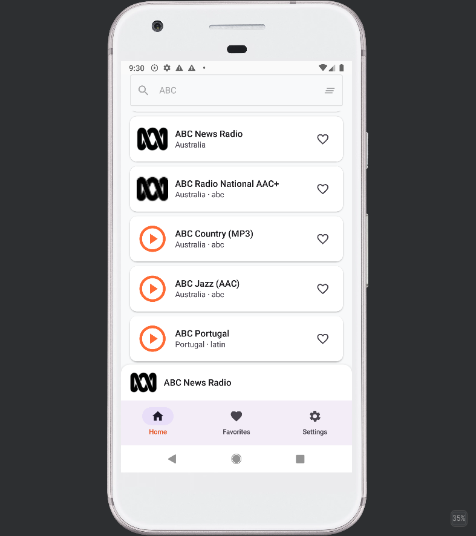
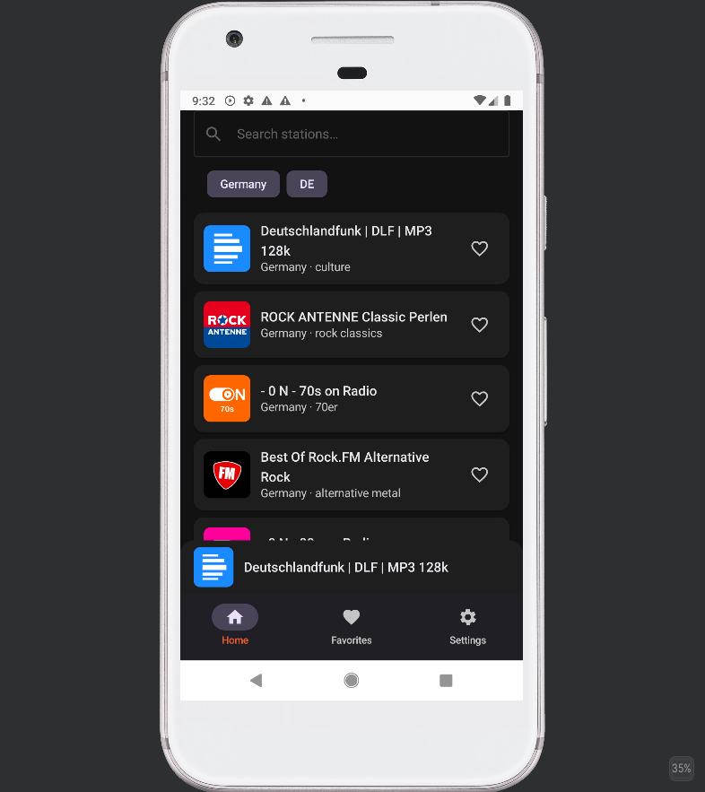
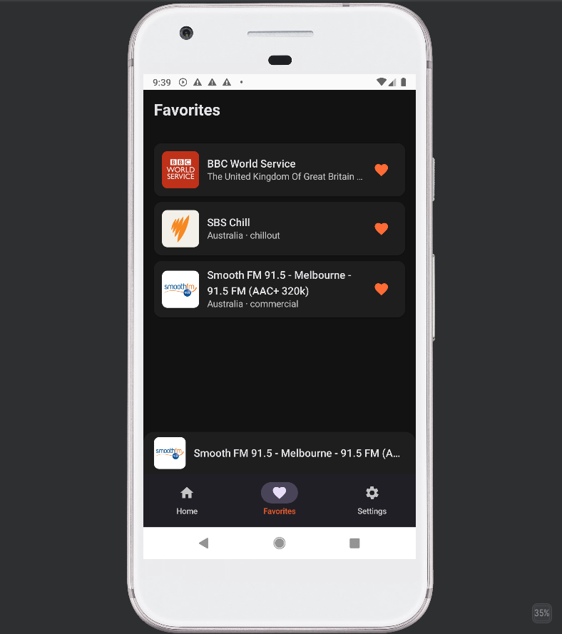
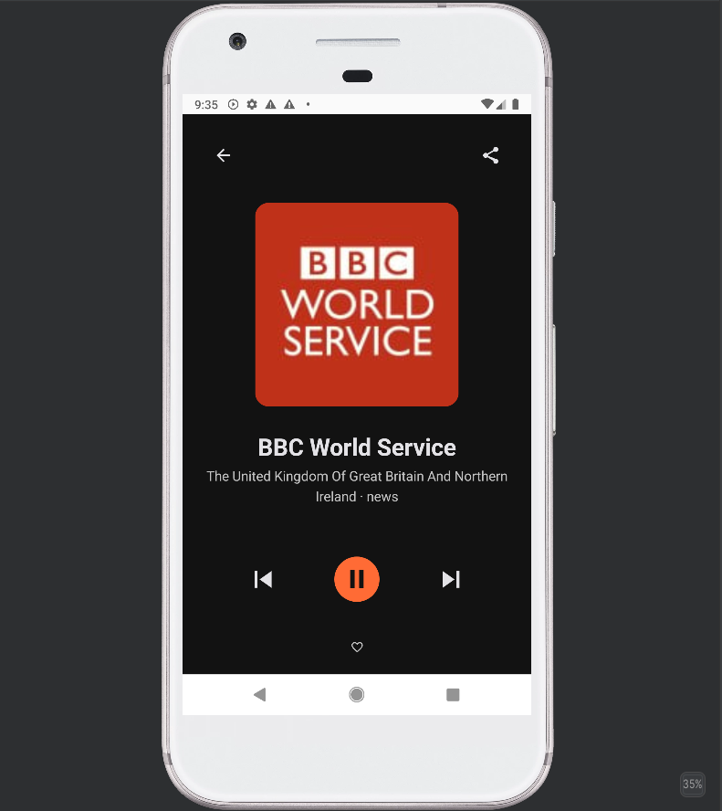

# Yin Radio

Yin Radio is an Android app for browsing, streaming, and saving internet radio stations from around the world. It keeps a full local copy of the station catalog so you can browse and search quickly, even when you are offline.

## What it does

- **Browse thousands of stations** - Search and filter a large public station catalog by name, country, language, or genre.
- **Offline-first browsing** - Download the full catalog once and keep it in a local Room database. Searching and browsing work without an internet connection after the first sync. (Streaming a station still needs a connection.)
- **Manual refresh** - On later launches you can request a fresh sync to update the local station catalog when you want.
- **Background playback** - Audio keeps playing when the app is in the background or the screen is off, controlled by a foreground `MediaSessionService` and ExoPlayer.
- **Audio focus & Bluetooth controls** - Volume ducks for notifications and pauses for calls or other apps. Bluetooth headset buttons work through `MediaSession`.
- **Favourites** - Save stations locally in Room, export them as JSON to back up or transfer, and import the same file later.
- **Now Playing bar** - A compact bar sits above the bottom navigation so you can tap to open the expanded player with artwork, play/pause, Previous/Next, and volume.
- **Previous / Next** - Skip through the current search or filter result set, not individual songs.
- **Themes** - Choose Light, Dark, or System Theme.
- **HTTP stream toggle** - HTTPS streams are allowed by default; `http://` streams are blocked unless enabled in Settings.

## Main screens

- **Home** - Browse featured and recent stations.
- **Discover** - Search by name and filter by country, language, or genre/tag.
- **Favorites** - Your saved stations, playable offline from the local cache.
- **Settings** - Theme, HTTP stream toggle, import/export favourites, and clear saved stations.

## How it works

The app fetches a paginated station catalog from a GitHub Pages API. On first launch it downloads every page, validates the full set, and writes it to Room in a single transaction so the database is never left half-populated. Later syncs compare the remote `lastUpdated` timestamp and only re-download when the catalog has changed.

Streaming connects directly to each station’s resolved URL - no proxy is used on Android.

## Tech stack

- Kotlin
- Jetpack Compose & Material 3
- Room (station cache and favourites)
- Ktor (networking)
- ExoPlayer / Media3 (audio playback)
- DataStore (settings)
- Coil (image loading)
- Koin (dependency injection)

## Companion web app

The repo also includes `yin-radio-web-app/`, a small Express + Alpine.js + Tailwind CSS prototype used for testing station browsing and streaming. It serves the same `radio-stations/stations.json` dataset and proxies audio streams through `/proxy?url=<stream_url>` to get around browser CORS restrictions. See `yin-radio-web-app/README.md` for setup details.

## Screenshots

