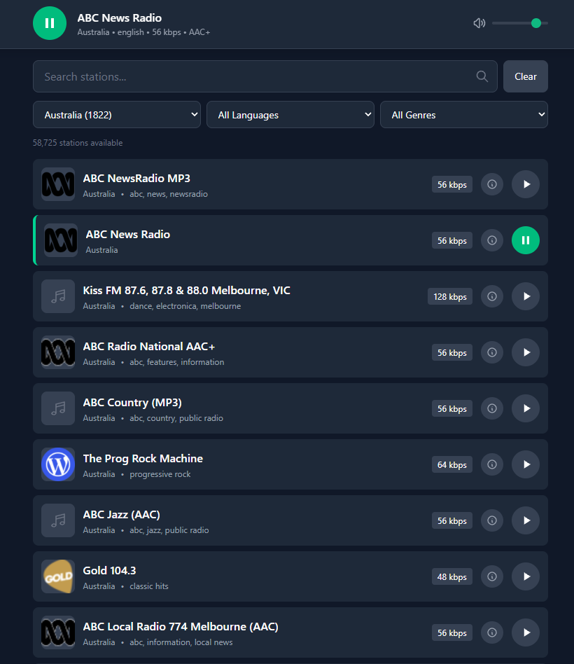

# Yin Radio Web App

A minimal internet radio web application for browsing and streaming live radio stations from around the world.



## Overview

Yin Radio lets you explore tens of thousands of internet radio stations, filter by country, language, or genre, and stream audio directly in your browser.

## Features

- **Browse 58,000+ stations** — Station data sourced from the Radio Browser API dataset
- **Search & filter** — Find stations by name, country, language, or genre/tag
- **Live streaming** — Stream audio directly through a built-in CORS proxy
- **Station metadata** — View details like bitrate, codec, geo coordinates, and votes
- **Responsive UI** — Clean, dark-themed interface built with Tailwind CSS

## Tech Stack

- **Backend:** Express.js (Node.js)
- **Frontend:** Alpine.js
- **Styling:** Tailwind CSS v4

## Project Structure

```
yin-radio-web-app/
├── public/
│   ├── index.html      # Main UI
│   ├── app.js          # Alpine.js application logic
│   └── css/
│       ├── input.css   # Tailwind source
│       └── output.css  # Compiled styles
├── server.js           # Express server & stream proxy
└── package.json
```

## Getting Started

### Prerequisites

- Node.js

### Installation

```bash
cd yin-radio-web-app
npm install
```

### CSS / Styling

The UI uses **Tailwind CSS v4**. Styles are compiled from `public/css/input.css` into `public/css/output.css`, which is what `index.html` loads.

**One-time production build:**

```bash
npm run build:css
```

**Watch mode (auto-recompiles on change):**

```bash
npm run watch:css
```

### Run

**Development mode** — runs the CSS watcher and the Express server together:

```bash
npm run dev
```

**Production mode** — runs the server only (make sure you have already built the CSS):

```bash
npm start
```

The app will be available at `http://localhost:3000`.

## How It Works

1. The Express server serves the static frontend from `public/`
2. Station data is loaded from `../radio-stations/stations.json`
3. Audio streams are proxied through `/proxy?url=<stream_url>` to bypass CORS restrictions
4. The Alpine.js frontend handles filtering, pagination, and audio playback

## License

MIT
